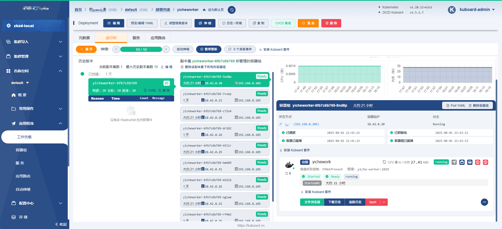

# 分布式爬虫 示例

## 项目结构
```text
DistributedCrawler/
├── Dockerfile_woker    工作节点的Dockerfile
├── worker_node.py      工作节点,用于监听MQ消息,执行任务
├── GenernalMethod.py   通用方法(易车的请求方法,MQ队列通用方法)
├── main.py             任务发布中心
└── README.md
```

## 运行流程


## k8s 部署worker节点   
> k8s 集群部署 , 单个 node 部署多个 pod

