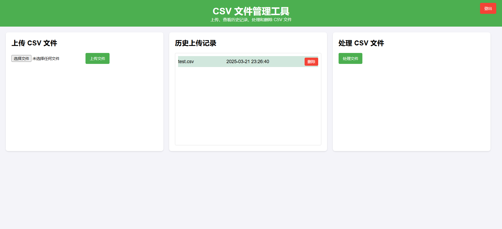
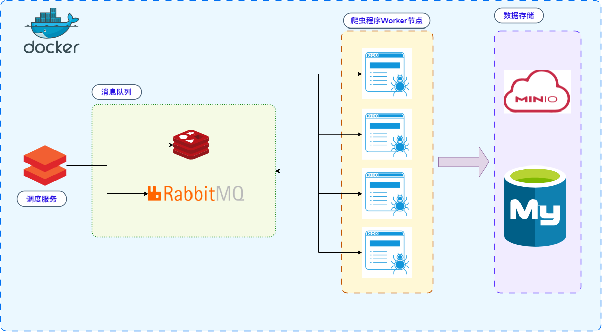
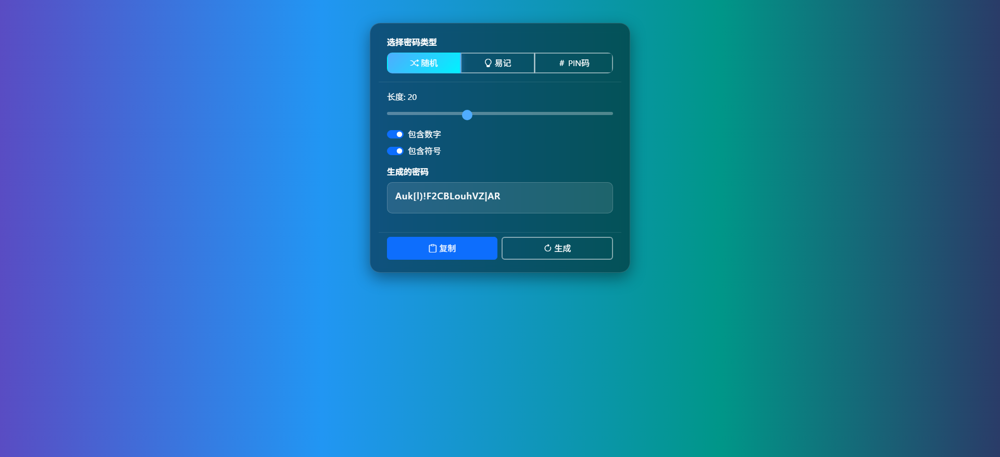

# 🐍 PythonDemo

本仓库用于记录与展示多个 **Python Demo** 项目示例，涵盖 NLP、向量数据库、OCR、分布式爬虫、密码生成等应用场景。  
适合学习、参考与二次开发。

> **Author** : [Mr-Glacier](https://github.com/Mr-Glacier)

---

## 📌 目录

### DEMO-1 : [Text2vec](text2vec/README.md)
- Thanks for [text2vec](https://github.com/shibing624/text2vec)
- 构建基于 **Text2vec** 模型的 API 服务端  
- 用于文本向量化处理

---

### DEMO-2 : [Qdrant Tool Usage](qdrantTool/README.md)
- Qdrant 向量数据库使用方法示例  
- 记录基本操作与实践方法

---

### DEMO-3 : [Data Processing Vector](dataProcessingVector/README.md)
- 向量数据导入与处理平台  
- 用于处理上传的固定格式 `.csv` 文件  

---

### DEMO-4 : [PaddleOCR](paddleocr/README.md)
- Thanks for [PaddleOCR](https://paddlepaddle.github.io/PaddleOCR/latest/quick_start.html)
- 基于 **PaddleOCR** 构建的 API 服务端  
- 提供图片文字识别功能  

---

### DEMO-5 : [DistributedCrawler](DistributedCrawlers/README.md)
- 分布式爬虫系统  
- 基于 **MQ 消息队列** 进行任务分发  
- 使用 **MinIO** 进行数据存储  
- 提供任务调度中心  

---

### DEMO-6 : [RandomPassword](RandomPassword/README.md)
- 在线随机密码生成器  
- 支持多种密码类型与自定义长度  

---

## 📜 说明
- 所有 DEMO 均为可运行的 Python 项目
- 部分 DEMO 依赖第三方库或服务，请参考对应目录下的 `README.md` 获取安装与使用说明
- 欢迎在此基础上进行扩展与优化
